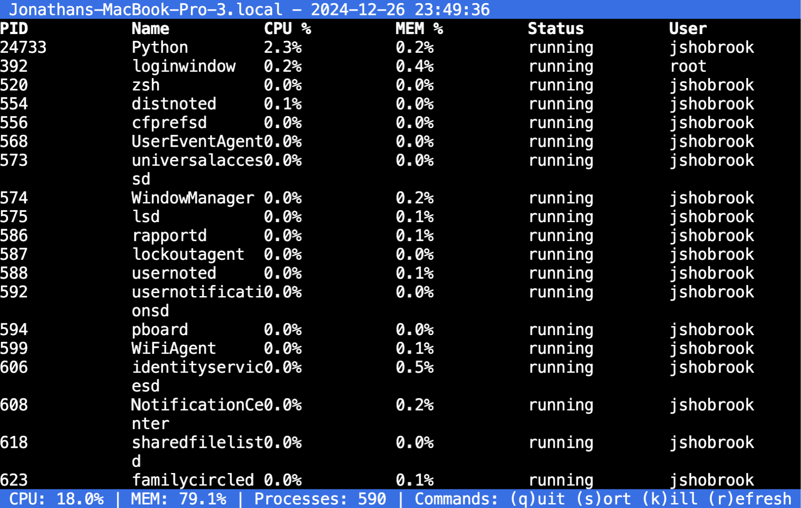
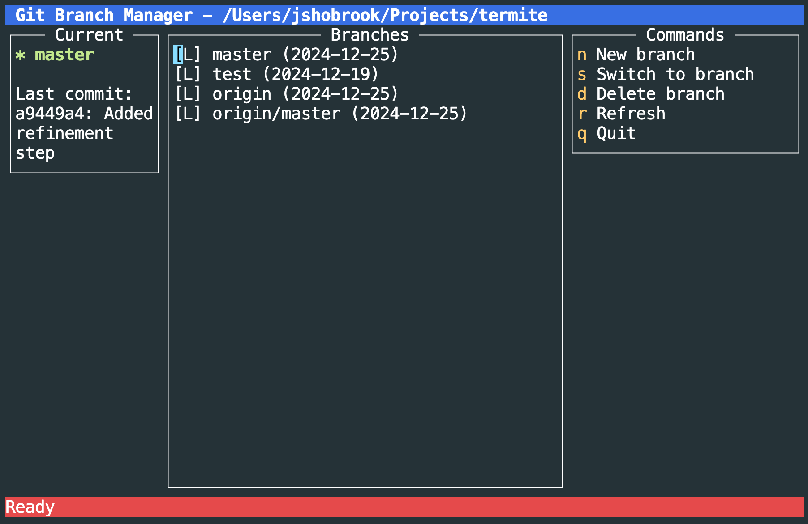
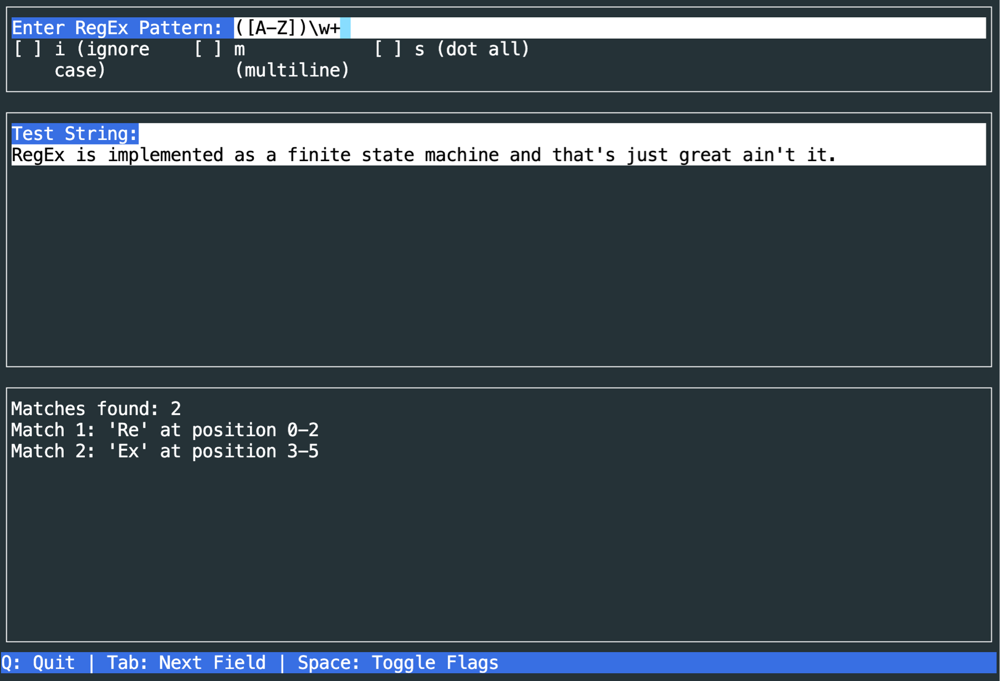

# 🐛 Termite

**Generate terminal UIs with simple text prompts.**


Termite lets you quickly prototype a terminal app to solve a problem. It works well for tasks like:

- "Show me which ports are active"
- "Make me a throughput monitor for my Redis queue"
- "Help me manage my Docker containers"
- "Diff these two SQL tables"

Under the hood, an LLM is generating and auto-executing a Python script that implements the UI. By default, UIs are built with the [urwid](https://urwid.org/) library, but you can also choose from [rich](https://rich.readthedocs.io/en/latest/), [curses](https://docs.python.org/3/library/curses.html), and [textual](https://textual.textualize.io/).

Please use with caution. Termite is still very experimental and it's obviously risky to run AI-generated code.

## Installation

```bash
> pipx install termite-ai
```

Once installed, you can use OpenAI or Anthropic as your LLM provider. Just add the appropriate API key to your environment:

```bash
> export OPENAI_API_KEY="..." # For GPT
> export ANTHROPIC_API_KEY="..." # For Claude
```

If you're using OpenAI, you can also set your API URL by adding the following to your environment:

```bash
> export OPENAI_BASE_URL="..." # Default to None
```

For the best results, use Anthropic. For faster and cheaper results, use OpenAI.

## Usage

To use, run the following:

```bash
> termite
```

You'll be asked to describe what you want to build. Do this, and then Termite will execute the following steps:

1. Generate a design document based on your prompt.
2. Implement a TUI in Python.
3. Iteratively fix runtime errors, if any exist.
4. (Optional) Iteratively refine the TUI based on self-reflections.

Once finished, your TUI will be saved to the `~/.termite` directory and automatically started up for you to use.

### Advanced Usage

You can configure the steps above with the following command-line arguments:

- `--library`: Specify the library Termite should use to build the TUI. Options are: urwid, rich, textual, and curses. Default is urwid.
- `--refine`: Setting this will improve the output by adding a self-reflection and refinement step to the process.
- `--refine-iters`: Controls the number of times the TUI should be refined, if `--refine` is enabled. Default is 1.
- `--fix-iters`: Controls the maximum number of attempts Termite should make at fixing a bug with the TUI. Default is 10.

## Examples

> Built something cool? [Submit a PR](https://github.com/shobrook/termite/pulls) to add your example here.

**"Make me a simple process monitor"**



**"Help me manage my Git branches (view, create, switch, etc.)"**



**"I need a quick way to test some RegEx patterns"**



## Roadmap

The bottleneck in most code generation pipelines is the verifier. That is, how can we verify that the generated code is what we want? Termite currently does the bare minimum for verification –– we execute the TUI in a pseudo-terminal to detect runtime exceptions. But a TUI can still look or behave improperly even if it runs without errors...

Some ideas:

1. Capture an image of what the TUI looks like and feed it to GPT-4o Vision for evaluation. This could help verify UI correctness.
2. Use an agent to simulate user actions in the TUI and record the results. This could help verify functionality correctness. But the problem here is some actions in a TUI can be destructive (e.g. killing a process in `htop`).
